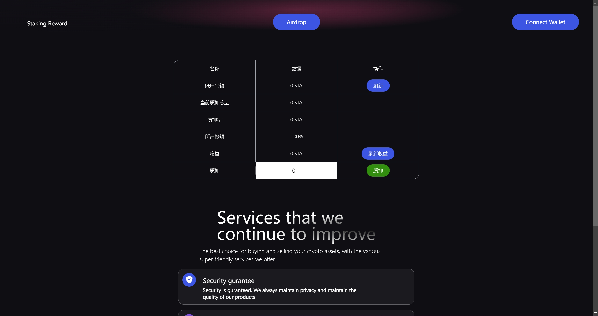
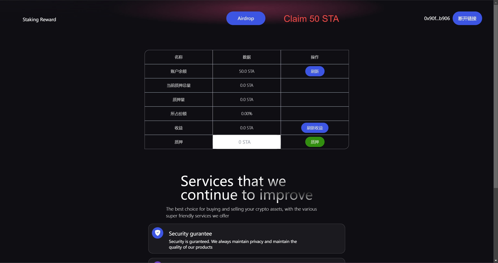
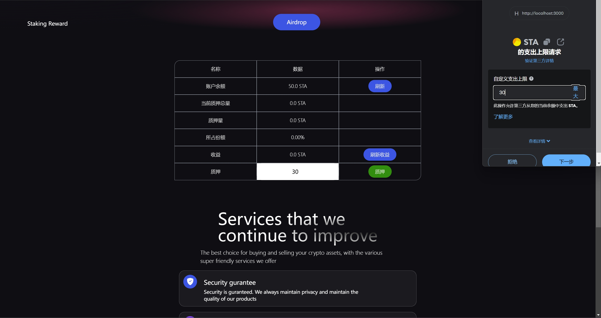
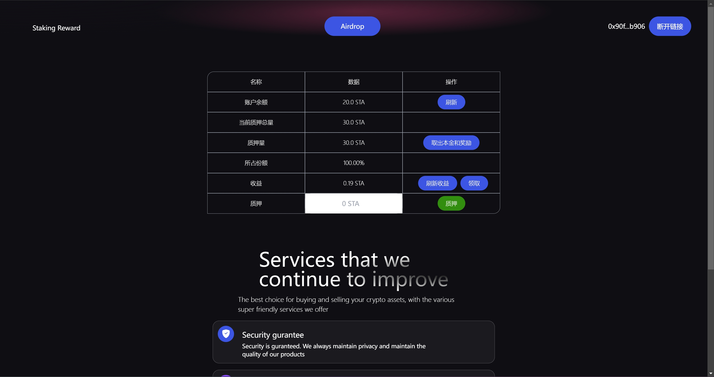

# web3-staking

## 业务介绍

实现了空头领取，质押获取流动性，可以一直产生收益。

### 场景

- 领取空投
- 质押STA
- 刷新STA奖励
- 领取流动性奖励
- 撤回质押

## 本地部署和环境配置

#### 项目环境准备
1. nodejs
2. hardhat
3. next.js

#### 项目配置
1. 进入s-contract,依赖安装 `yarn`
2. 启动本地链 `npx hardhat node`
3. 部署合约（本地）
    
    `npx hardhat run ./script/deploy.js --network localhost`
    
    部署后控制台打印合约地址，初次部署是这个地址：
    STAToken deployed to:  0x5FbDB2315678afecb367f032d93F642f64180aa3

    Air deployed to:  0xe7f1725E7734CE288F8367e1Bb143E90bb3F0512

    Staking deployed to:  0x9fE46736679d2D9a65F0992F2272dE9f3c7fa6e0
    
    把这个地址写到`s-client/src/contract/ContractConfig.js`中

4. 进入s-client，依赖安装 `yarn` 启动前端
    `yarn dev`
    
### 流程

